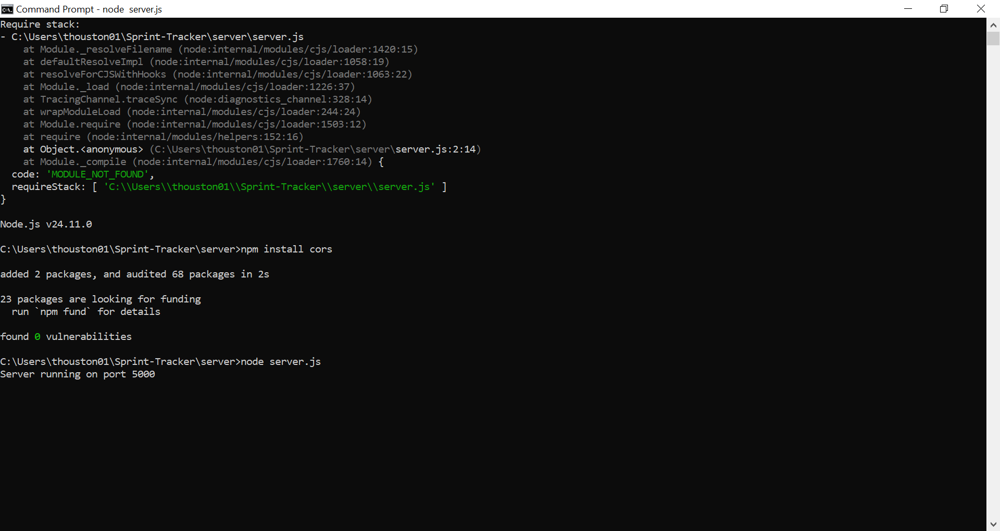
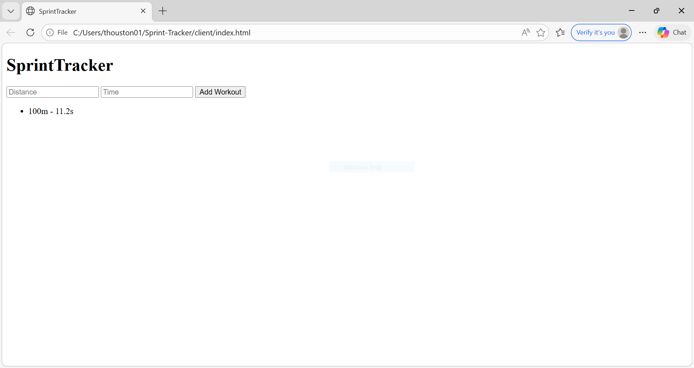

# Milestone 2 – SprintTracker Progress

## System Overview
SprintTracker is a full-stack application that allows users to log sprint workouts (distance and time) and view them in real time. The system uses a frontend interface, a Node.js backend API, and a simple in-memory data store (temporary before database integration).

---

## Frontend Progress
A basic HTML interface has been created that allows users to:
- Enter workout distance
- Enter workout time
- Submit workout data
- View logged workouts dynamically

This demonstrates working user interaction and real-time UI updates.

---

## Backend Progress
A Node.js + Express backend has been implemented with the following endpoints:

- GET /api/workouts → retrieves all workouts
- POST /api/workouts → adds a new workout

The backend successfully processes requests and stores data in memory.

---

## Database Status
Currently using an in-memory array to store workouts. This will be replaced with a PostgreSQL database in the next milestone.

---

## System Architecture
The system follows a simple client-server architecture:
- Client: HTML/JavaScript frontend
- Server: Node.js + Express API
- Data: Temporary in-memory storage

---

## Demonstration Evidence
A working demo shows:
- Server running on localhost:5000
- User adding workout data
- Data appearing instantly on the page

---

## Challenges
- Setting up frontend-backend communication
- Handling and installing cross-origin requests (CORS). It wouldn't run without it
- Debugging fetch requests since I kept seeing errors

---

## Next Steps
- Integrate PostgreSQL database
- Improve UI using React
- Add user authentication
- Improve error handling and validation

## Screenshots

### Server Running

### Workout Added + Able to type Distance/Time

