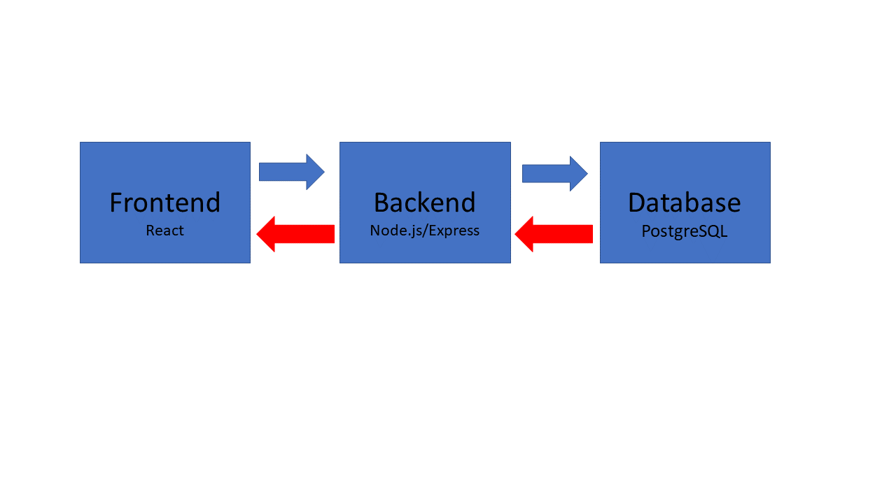

# System Architecture – SprintTracker

## 1. System Overview

SprintTracker is a full-stack web application that allows athletes to log workouts, track performance, and visualize training progress over time. The system is designed to help users organize their training data and gain insights through simple analytics and charts.

The primary users are athletes (especially track and field athletes) and coaches who want a centralized platform for tracking workouts and performance. The main workflows include user registration and login, logging workouts, recording performance results, viewing past data, and analyzing trends through charts and summaries.

---

## 2. High-Level Architecture Diagram

**Component Responsibilities:**

- **Frontend (React):** Handles the user interface, input forms, and displays data including charts.
- **Backend (Node.js / Express):** Processes API requests, handles business logic, and communicates with the database.
- **Database (PostgreSQL):** Stores user accounts, workouts, and performance data.

**Data Flow:**

The user interacts with the frontend, which sends requests to the backend API.  
The backend processes the request, interacts with the database, and returns data back to the frontend for display.

---

## 3. Layering / Code Organization Plan

**Folder Structure:**

/client  
/server  
/db  
/api  
/config  
/tests  

**Layer Breakdown:**

- **Presentation Layer:** `/client` (user interface and interaction)
- **Business Logic Layer:** `/server` (application logic and processing)
- **Data Access Layer:** `/db` (database queries and models)
- **API Layer:** `/api` (routes and endpoints)

**Explanation:**

Separating the system into layers reduces coupling by keeping responsibilities independent. The frontend does not directly access the database, and backend logic is separated from UI concerns. This improves maintainability because changes in one layer do not affect others. It also makes the system easier to debug and extend in the future.

---

## 4. Database Schema

**Users Table**
- user_id (Primary Key)
- username (Unique, Required)
- email (Unique, Required)
- password (Required)

**Workouts Table**
- workout_id (Primary Key)
- user_id (Foreign Key → Users.user_id, Required)
- distance (Required)
- duration (Required)
- intensity
- notes
- date (Required)

**Performances Table**
- performance_id (Primary Key)
- user_id (Foreign Key → Users.user_id, Required)
- event_type (Required)
- time (Required)
- date (Required)

**Relationships:**
- One user can have many workouts
- One user can have many performances

---

## 5. API / Interface Plan

**POST /api/register**  
Input: username, email, password  
Output: success message or user object  
Error: user already exists  

**POST /api/login**  
Input: email, password  
Output: authentication token  
Error: invalid credentials  

**POST /api/workouts**  
Input: user_id, distance, duration, intensity, notes, date  
Output: created workout  
Error: missing required fields  

**GET /api/workouts**  
Input: user_id  
Output: list of workouts  
Error: user not found  

**PUT /api/workouts/:id**  
Input: workout_id, updated data  
Output: updated workout  
Error: workout not found  

**DELETE /api/workouts/:id**  
Input: workout_id  
Output: success message  
Error: workout not found  

---

## 6. Technical Risk List

**1. Learning New Technologies**  
Risk: React and Chart.js may be unfamiliar.  
Mitigation: Build small prototypes early to understand how they work.

**2. Database Relationships**  
Risk: Incorrect handling of foreign keys and relationships.  
Mitigation: Carefully design the schema and test database operations early.

**3. Authentication Security**  
Risk: Improper password handling or insecure login system.  
Mitigation: Use password hashing (bcrypt) and token-based authentication.

**4. Frontend-Backend Integration**  
Risk: API requests may fail or not connect properly.  
Mitigation: Test backend endpoints independently before connecting the frontend.

---

## 7. Design Review Checklist

**Does each component have a clear responsibility?**  
Yes. The frontend handles UI, the backend handles logic, and the database handles storage.

**Where are the biggest dependencies?**  
The backend depends on the database, and the frontend depends on the backend API.

**What part of the system is most complex?**  
The complex part would be authentication and the communication between frontend and backend.

**What can you simplify right now?**  
What I can simplify right now is focusing on core features like logging, logging workout, and adding basic charts before adding advanced features.
